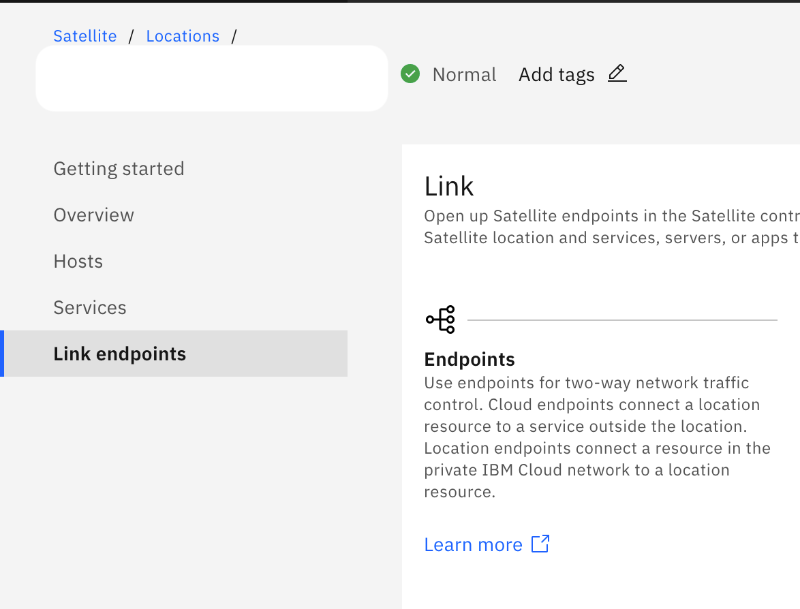
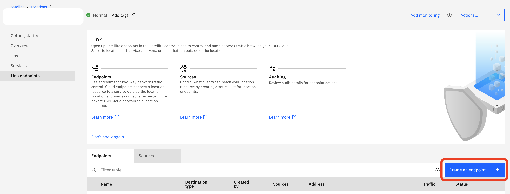
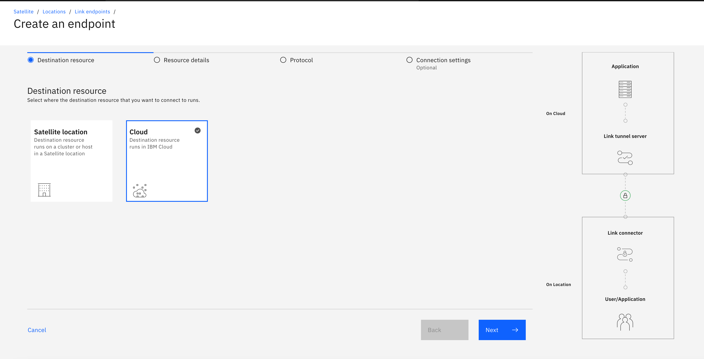
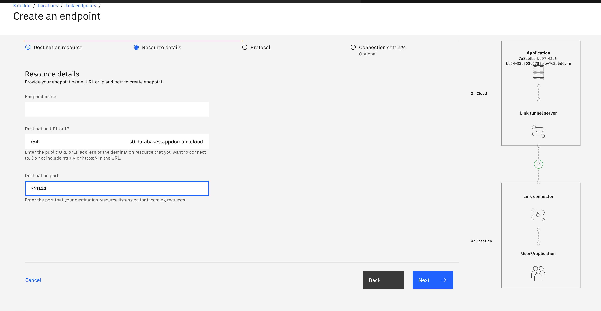
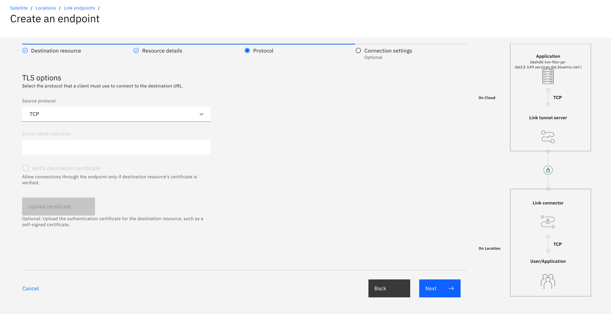
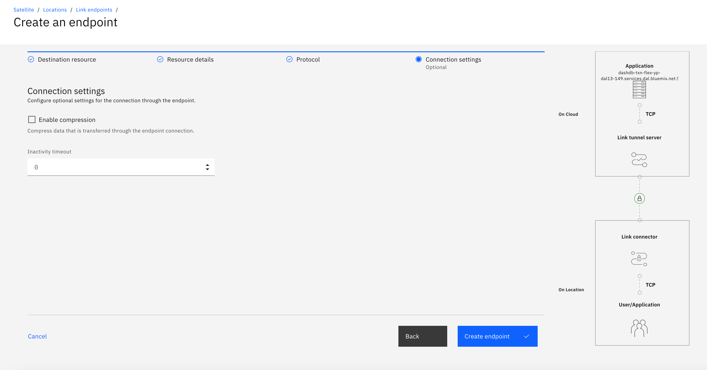
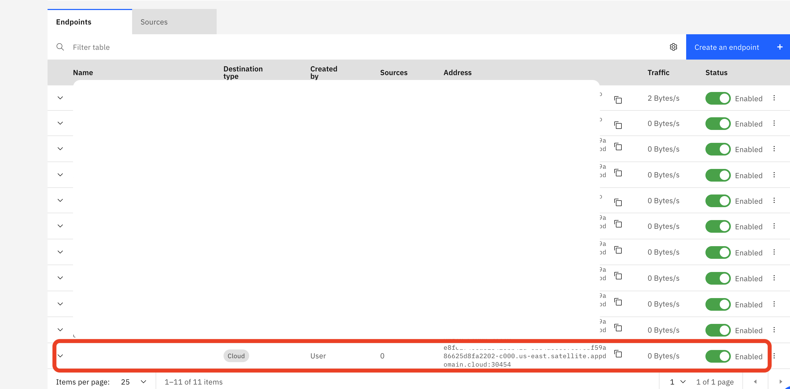
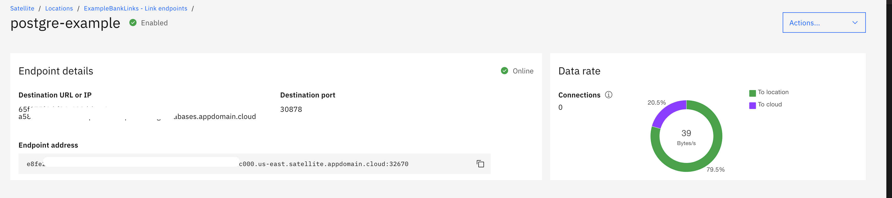

# Hands-on: Connect and communicate with a service on IBM Cloud from Satellite location using Satellite Link endpoints

## Introduction

The purpose of this tutorial is to give a hands-on experience of IBM Cloud Satellite and Satellite Link endpoints. With the help of Satellite Link endpoints, we can connect to a service, server, or app that runs outside of the location from a client that runs in your Satellite location, or vice-versa. In this tutorial you will learn, how to link a database service on IBM Cloud to your IBM Cloud Satellite location and verify the connection by sending the data and receiving the data.

## Prerequisites

[IBM Cloud Account](https://cloud.ibm.com/)

## Estimated time

It will take you approximately 30 minutes to complete this tutorial.

## Steps

#### 1. Create a Satellite location in IBM Cloud.

- From the [Satellite Locations dashboard](https://cloud.ibm.com/satellite/locations), click Create location. A location represents a data center that you can fill with your own infrastructure resources to run IBM Cloud services or other workloads on your own infrastructure.
- Enter a name and an optional description for your location.
- Select the IBM Cloud region that you want to use to manage your location. For more information about why you must select an IBM Cloud region, see [About IBM Cloud regions for Satellite](https://cloud.ibm.com/docs/satellite?topic=satellite-sat-regions#understand-supported-regions). Make sure to select the region that is closest to where your host machines physically reside that you plan to add to your Satellite location to ensure low network latency between your Satellite location and IBM Cloud.
- Click Create location. When you create the location, a location master is deployed to one of the zones that are located in the IBM Cloud region that you selected.

#### 2. Attaching hosts from on-premises data centers and edge networks

- Hosts are machines that reside in your infrastructure In your on-premises environment, identify or create at least three host machines in physically separate racks, which are called `zones` in Satellite, that meet the [minimum hardware requirements](https://cloud.ibm.com/docs/satellite?topic=satellite-host-reqs).

- Follow the steps in this [link](https://cloud.ibm.com/docs/satellite?topic=satellite-getting-started#gs-attach-hosts-onprem) to attach hosts from on-premises data centers and edge networks. 

#### 3. Assign hosts to the Satellite location control plane

- From the actions menu of each host machine that you attached, click `Assign host`.
- For the Cluster, select `Control plane`.
- For the Zone, select a unique zone such as `zone-1`.
- Click `Assign host`. 
>>NOTE: When you assign the hosts to the control plane, IBM bootstraps your machine. This process might take a few minutes to complete. During the bootstrapping process, the Health of your machine changes from Ready to Provisioning.
- Repeat these steps for each host. Make sure that you assign each host to a different zone so that you spread all three hosts across all three zones, such as `zone-1`, `zone-2`, and `zone-3`.
- From the Hosts tab, verify that your hosts are successfully assigned to the Satellite control plane. The assignment is successful when an IP address is added to your host and the Health status changes to Normal.

#### 4. Create PostgreSQL database and link it to IBM Cloud Satellite

A cloud endpoint allows you to securely connect to a service, server, or app that runs outside of the location from a client within your Satellite location.

<b>Create the Service</b>

- Create a [Databases for PostgreSQL](https://cloud.ibm.com/catalog/services/databases-for-postgresql) service.

- Choose `Databases for PostgreSQL`. Click on `Create`.

- Name your database and click on `Create`.

- Once the service is ready, click on "Service credentials" in the navigation pane and select the "New credential" option and create credentials. Copy `Host` url and `Port` number. .

- These service credentials will be used to create an Endpoint Link for the Satellite location.

<b>Link the Service to your satellite</b>
- Click on `Link Endpoints` tab.

- Click on `Create on Endpoint` as shown below.

- Select `Cloud` and click on next.

- Enter an `Endpoint name`. In `Destinaion URL or IP` paste the host name that you copied when you created the PostgreSQL service cerdentials . In `Destination port` paste the port number that you copied when you created PostgreSQL service credentials.

- Leave the default value and click on `Next` as shown below.

- Click on `Create endpoint` as shown below.

- It takes few moments to create an endpoint. Once the endpint is created, you can view it under Endpoints as shown below.

>> Note: You can follow the same procedure for other services on IBM Cloud.

#### 5. Create the OpenShift Cluster that will live on your satellite location and deploy the application

- Here we create the OpenShift cluster that will live on your satellite location. 

- Follow the steps in this [link](https://cloud.ibm.com/docs/satellite?topic=openshift-satellite-clusters#satcluster-create-console) to create OpenShift clusters on Satellite from the console.

- Now you can deploy an application of your choice. - If you dont have any application that require a database, follow the next step.

#### 6. Send data to PostgreSQL database using the Satellite endpoint

- Copy the `Satellite endpoint` link that you created in step 4.

- Copy the `username` and `password` from the credentials that you created in step 4. 

- Goto [this](https://github.com/IBM/satellite-link-example) sample and follow the steps

- Run the application and send/receive data via `Satellite endpoint`.

## Summary

With IBM cloud satellite you can quickly address unforeseen challenges, leverage cloud benefits in any location and innovate quickly anytime anywhere.

## Related links
Now that you know how a satellite link works, try something more complex. Check out the following code pattern that helps you build an IoT application at your location uisng IBM Cloud Pak for Data and IBM Cloud Satellite. 
 
[Monitor and Analyze IoT data at your location using IBM Cloud Satellite and IBM Cloud Pak for Data](https://github.ibm.com/raravi86/Satellite-IoT)
