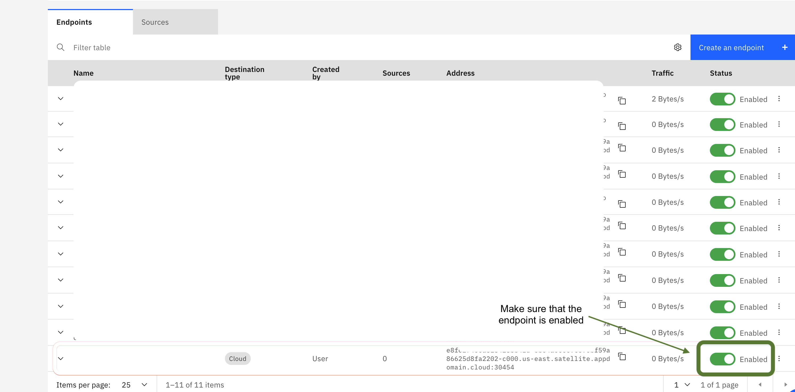

---
#Front matter (metadata).
abstract:               # REQUIRED

authors:
 - name: "Rahul Reddy Ravipally"
   email: "raravi86@in.ibm.com"
 - name: "Amol Dhondse"
   email: "amol.dhondse@in.ibm.com"
 - name: "Srikanth Manne"
   email: "srikanth.manne@in.ibm.com"
 - name: "Manjula G. Hosurmath"
   email: "mhosurma@in.ibm.com"

completed_date: 2021-05-03

components:
- slug: "IBM Cloud"
  name: "Ibm Cloud"
  url: "https://cloud.ibm.com/"
  type: "component"
  
draft: true|false       # REQUIRED

excerpt:                # REQUIRED

keywords:               # REQUIRED - comma separated list

last_updated:           # REQUIRED - Note: date format is YYYY-MM-DD

primary_tag:          # REQUIRED - Note: Choose only only one primary tag. Multiple primary tags will result in automation failure. Additional non-primary tags can be added below.

pta:                    # REQUIRED - Note: can be only one
# For a full list of options see https://github.ibm.com/IBMCode/Definitions/blob/master/primary-technology-area.yml
# Use the "slug" value found at the link above to include it in this content.
# Example (remove the # to uncomment):
 # - "cloud, container, and infrastructure"

pwg:                    # REQUIRED - Note: can be one or many
# For a full list of options see https://github.ibm.com/IBMCode/Definitions/blob/master/portfolio-working-group.yml
# Use the "slug" value found at the link above to include it in this content.
# Example (remove the # to uncomment):
# - "containers"

related_content:        # OPTIONAL - Note: zero or more related content
  - type: patterns
    slug:

related_links:           # OPTIONAL - Note: zero or more related links
  - title:   Connect and communicate with a service on IBM Cloud from Satellite location using Satellite Link endpoints
    url:     https://github.com/IBM/satellite-iot
    description:

runtimes:               # OPTIONAL - Note: Select runtimes from the complete set of runtimes below. Do not create new runtimes. Only use runtimes specifically in use by your content.
# For a full list of options see https://github.ibm.com/IBMCode/Definitions/blob/master/runtimes.yml
# Use the "slug" value found at the link above to include it in this content.
# Example (remove the # to uncomment):
 # - "asp.net 5"

series:                 # OPTIONAL
 - type:
   slug:

services:               # OPTIONAL - Note: please select services from the complete set of services below. Do not create new services. Only use services specifically in use by your content.
# For a full list of options see https://github.ibm.com/IBMCode/Definitions/blob/master/services.yml
# Use the "slug" value found at the link above to include it in this content.
# Example (remove the # to uncomment):
# - "blockchain"

subtitle:               # REQUIRED

tags:
# Please select tags from the complete set of tags below. Do not create new tags. Only use tags specifically targeted for your content. If your content could match all tags (for example cloud, hybrid, and on-prem) then do not tag it with those tags. Less is more.
# For a full list of options see https://github.ibm.com/IBMCode/Definitions/blob/master/tags.yml
# Use the "slug" value found at the link above to include it in this content.
# Example (remove the # to uncomment):
 # - "blockchain"

title:                  # REQUIRED

translators:             # OPTIONAL - Note: can be one or more
  - name:
    email:

type: tutorial

---

# Hands-on: Connect and communicate with a service on IBM Cloud from Satellite location using Satellite Link endpoints

## Introduction

The purpose of this tutorial is to give a hands-on experience of IBM Cloud Satellite and Satellite Link endpoints. With the help of Satellite Link endpoints, we can connect to a service, server, or app that runs outside of the location from a client that runs in your Satellite location, or vice-versa. In this tutorial you will learn, how to link a database service on IBM Cloud to your IBM Cloud Satellite location and verify the connection by sending the data and receiving the data.

## Prerequisites

[IBM Cloud Account](https://cloud.ibm.com/)

## Estimated time

It will take you approximately 30 minutes to complete this tutorial.

## Steps

#### 1. Create a Satellite location in IBM Cloud.

A location represents a data center that you can fill with your own infrastructure resources to run IBM Cloud services or other workloads on your own infrastructure.

- From the [Satellite Locations dashboard](https://cloud.ibm.com/satellite/locations), click Create location. 
- Enter a name and an optional description for your location.
- Select the IBM Cloud region that you want to use to manage your location.
- Click Create location. 

#### 2. Attaching hosts from on-premises data centers and edge networks

- Hosts are machines that reside in your infrastructure In your on-premises environment, identify or create at least three host machines in physically separate racks, which are called `zones` in Satellite, that meet the [minimum hardware requirements](https://cloud.ibm.com/docs/satellite?topic=satellite-host-reqs).

- Follow the steps in this [link](https://cloud.ibm.com/docs/satellite?topic=satellite-getting-started#gs-attach-hosts-onprem) to attach hosts from on-premises data centers and edge networks. 

#### 3. Assign hosts to the Satellite location control plane

- From the actions menu of each host machine that you attached, click `Assign host`.
- For the Cluster, select `Control plane`.
- For the Zone, select a unique zone such as `zone-1`.
- Click `Assign host`. 
>>NOTE: When you assign the hosts to the control plane, IBM bootstraps your machine. This process might take a few minutes to complete. During the bootstrapping process, the Health of your machine changes from Ready to Provisioning.
- Repeat these steps for each host. Make sure that you assign each host to a different zone so that you spread all three hosts across all three zones, such as `zone-1`, `zone-2`, and `zone-3`.
- From the Hosts tab, verify that your hosts are successfully assigned to the Satellite control plane. The assignment is successful when an IP address is added to your host and the Health status changes to Normal.

#### 4. Create the OpenShift Cluster that will live on your satellite location

- Here we create the OpenShift cluster that will live on your satellite location. 

- Follow the steps in this [link](https://cloud.ibm.com/docs/satellite?topic=openshift-satellite-clusters#satcluster-create-console) to create OpenShift clusters on Satellite from the console.

- Now you can deploy an application of your choice.

#### 5. Create PostgreSQL database and link it to IBM Cloud Satellite

A cloud endpoint allows you to securely connect to a service, server, or app that runs outside of the location from a client within your Satellite location.

#### 5.1 Create the Service

- Create a [Databases for PostgreSQL](https://cloud.ibm.com/catalog/services/databases-for-postgresql) service.

- Choose `Databases for PostgreSQL`. Click on `Create`.

- Name your database and click on `Create`.

- Once the service is ready, click on "Service credentials" in the navigation pane and select the "New credential" option and create credentials. Copy `Host` url and `Port` number. .

- These service credentials will be used to create an Endpoint Link for the Satellite location.

#### 5.2 Link the Service to your satellite

- Click on `Link Endpoints` tab.

- Click on `Create on Endpoint` as shown below.

- Select `Cloud` and click on next.

- Enter an `Endpoint name`. In `Destination URL or IP` paste the host name that you copied when you created the PostgreSQL service credentials . In `Destination port` paste the port number that you copied when you created PostgreSQL service credentials.

- Leave the default value and click on `Next` as shown below.

- Click on `Create endpoint` as shown below.

- It takes few moments to create an endpoint. Once the endpoint is created, you can view it under Endpoints as shown below.

>> Note: You can follow the same procedure for other services on IBM Cloud.

#### 6. Send data to PostgreSQL database using the Satellite endpoint

>> Note: Make sure that your satellite endpoint is enabled as shown below. If the endpoint is not enabled you will not be able to send or receive data using the endpoint.

- Copy the `Satellite endpoint` link that you created in <b>step 5.2</b>.

- Copy the `username` and `password` from the credentials that you created in <b>step 5.1</b>. 

- Goto [this](https://github.com/IBM/satellite-link-example) sample and follow the steps

- Run the application and send/receive data via `Satellite endpoint`.

## Summary

With IBM cloud satellite you can quickly address unforeseen challenges, leverage cloud benefits in any location and innovate quickly anytime anywhere.

## Related links
Now that you know how a satellite link works, try something more complex. Check out the following code pattern that helps you build an IoT application at your location using IBM Cloud Pak for Data and IBM Cloud Satellite. 
 
[Monitor and Analyze IoT data at your location using IBM Cloud Satellite and IBM Cloud Pak for Data](https://github.com/IBM/satellite-iot)
